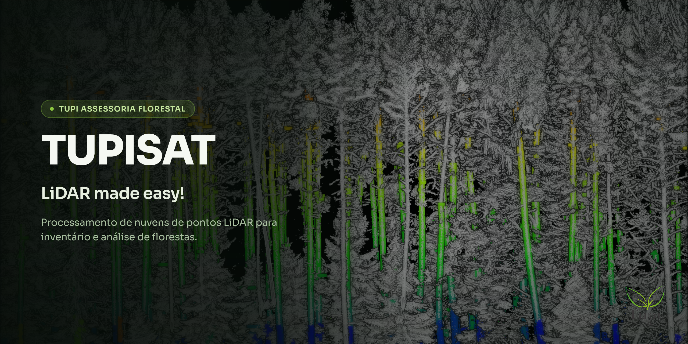

 


# TUPISAT

## Description
TUPISAT is a fork of SegmentAnyTree (SAT) — the sensor- and platform-agnostic tree segmentation model from [Wielgosz et al. (2024), *SegmentAnyTree: A sensor and platform agnostic deep learning model for tree segmentation using laser scanning data*, Remote Sensing of Environment](https://www.sciencedirect.com/science/article/pii/S0034425724003936) — extended with a resumable batch pipeline and a forest inventory metrics module (`tupisat_inference/forest_metrics/`) that computes per-tree and plot-level variables (DBH, height, taper, stem volume, crown metrics, stand-level statistics) directly from the segmented output, along with FSCT-style point-cloud visualizations (diameter circles, ID/DBH/height labels, tree base markers).

Under the hood, SegmentAnyTree relies on the [torch-points3d framework](https://github.com/torch-points3d/torch-points3d) as the code base. So please take a look there for more information regarding the training and parametrization of the code.

## Usage
The code has been tested on a Linux machine and it relies on a docker image. The method has not been tested in a Windows environment and parts of the code (e.g. Minkowski Engine) might not be available for Windows.

### Using the docker image
There is a quick start for all who want to quickly process the data.

### Quick start
1. Create the necessary folders
2. Upload your files to the folders
3. Build (or pull) the docker image
4. Run the model
5. Check the results in the output folder

```
mkdir -p $HOME/tupisat/input
mkdir -p $HOME/tupisat/output

docker build -f Dockerfile.pandas-fix -t tupisat:latest .

docker run -it --rm --gpus all \
  --mount type=bind,source=$HOME/tupisat/input,target=/home/nibio/mutable-outside-world/bucket_in_folder \
  --mount type=bind,source=$HOME/tupisat/output,target=/home/nibio/mutable-outside-world/bucket_out_folder \
  tupisat:latest

```

### Additional information

`Dockerfile.pandas-fix` is a thin patch layer on top of the original SegmentAnyTree image (`docker pull maciekwielgosz/segment-any-tree:latest`) — it fixes a broken pandas/scikit-learn install in that image and adds the resumable batch pipeline and forest metrics module. If you'd rather build everything from scratch instead of patching the upstream image, use `Dockerfile` (or `Dockerfile_cuda_11.8.0` for CUDA 11.8, less tested).

The Quick start command above is the whole thing — just point `source=` at
your own input/output folders. For the full pipeline (wood/leaf separation,
dendrometric metrics, per-tree validation reports) and everything specific
to this fork, see [`runme.md`](runme.md).

### Batch processing, resuming and progress

The container processes every point cloud found in the input folder one at a
time and writes each result to the output folder as soon as it's ready
(`tupisat_inference/batch_orchestrator.py`). This means:

- **Resuming**: if the container is stopped or crashes partway through, just
  run it again against the same input/output folders. Point clouds whose
  result already exists are skipped; only the ones that hadn't finished are
  (re)processed. Progress is tracked in
  `<output_folder>/.sat_state/manifest.json`. A file that keeps failing is
  retried up to 3 times before being marked `error_permanent` and skipped
  (to avoid one broken file blocking the rest of the batch forever) -- delete
  its entry from the manifest, or pass `--force` to the orchestrator to
  reprocess everything from scratch.
- **Progress**: `docker logs` shows one line per processing step
  (`idx=3/10 file=... step=inference status=running`), and the periodic
  heartbeat line also reports which file/step is currently running, so you
  can tell what the container is doing without needing `docker exec`.

### Forest inventory metrics

Each processed point cloud gets its own `<name>_SAT_output/` folder (mirroring FSCT's `<name>_FSCT_output/` convention) containing:

- The segmented point cloud itself (`PredSemantic`/`PredInstance` per point).
- `<name>_tree_metrics.csv` — one row per tree: DBH, height, stem volume (taper-integrated and conic estimate), volume by log assortment, crown base height/diameter/area/volume, live crown ratio, and data-quality flags.
- `<name>_taper.csv` — per-tree diameter samples at regular height increments.
- `<name>_plot_summary.csv`/`.json` — plot-level stats: trees/ha, basal area, DBH distribution, canopy cover, spacing indices.
- `<name>_diameter_circles.laz`, `<name>_tree_labels.laz`, `<name>_tree_bases.laz` — point-cloud visualizations viewable in any point cloud viewer (CloudCompare, etc.).

Since SegmentAnyTree's semantic head is binary (tree / non-tree, no dedicated ground class), a DTM is derived from the non-tree points via a Cloth Simulation Filter. Tunables (RANSAC thresholds, log assortments, crown density thresholds, etc.) live in `tupisat_inference/forest_metrics/config.py` and can be overridden per run with `--config-json`.

## Training
Please follow the command to train the model.
`python train.py task=panoptic data=panoptic/treeins models=panoptic/area4_ablation_3heads model_name=PointGroup-PAPER training=treeins job_name=treeins_my_first_run`

In order to train the model you have to prepare the data. You can take a look at file : `sample_data_conversion.py` to check how it may be done. 

## Issues
If you encounter any issues with the code please raise an issue in this repo.

## Citation
TUPISAT builds on the model and training code described in the original SegmentAnyTree paper. If you use this code or the underlying model for your research or project, please cite the associated article:

```
@article{WIELGOSZ2024114367,
title = {SegmentAnyTree: A sensor and platform agnostic deep learning model for tree segmentation using laser scanning data},
journal = {Remote Sensing of Environment},
volume = {313},
pages = {114367},
year = {2024},
issn = {0034-4257},
doi = {https://doi.org/10.1016/j.rse.2024.114367},
url = {https://www.sciencedirect.com/science/article/pii/S0034425724003936},
author = {Maciej Wielgosz and Stefano Puliti and Binbin Xiang and Konrad Schindler and Rasmus Astrup},
keywords = {3D deep learning, Instance segmentation, ITC, ALS, TLS, Drones}
}
```
